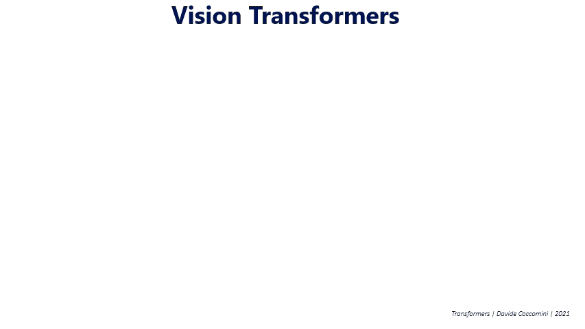

# Vision Transformer (VIT) Implementation

This project implements a Vision Transformer (ViT) model for classification tasks. 



## Dataset

The dataset used in this project can be found at (https://www.kaggle.com/datasets/vivmankar/asian-vs-african-elephant-image-classification) and contains two subdirectories: `train` and `test`. The `African` and `Asian` subdirectories within each contain the respective images in JPG format.

## Configuration

The project configuration is specified in the `config.yaml` file. This file contains settings for the ViT model, such as the embedding dimension, image size, patch size, number of classes, depth, number of heads, MLP dimension, and input channels. It also includes hyperparameters like the learning rate, batch size, number of epochs, and the gamma value for the learning rate scheduler.

## Installation

1. Clone the repository:
```bash
git clone https://github.com/Archit6019/Vision-Transformer-ViT-.git
```

2. Navigate to the project directory:
```bash
cd Vision-Transformer-ViT-
```

3. Install the required Python packages:
```bash
pip install -r requirements.txt
```

4. Add your dataset path, make sure the data is structured in the following way:
```bash
dataset
├── train
│   ├── African
│   │   ├── image1.jpg
│   │   ├── ...
│   ├── Asian
│   │   ├── image1.jpg
│   │   ├── ...
├── test
│   ├── African
│   │   ├── image1.jpg
│   │   ├── ...
│   ├── Asian
│   │   ├── image1.jpg
│   │   ├── ...

```

Add the name of the classes in the sub2 parameter in the main function.

5. Run the `train.py` script:
```bash
python train.py
```

The script will preprocess the dataset, create data loaders, initialize the ViT model, and start the training process. Progress and performance metrics will be printed to the console during training. The best model will be saved as `best_model.pth`.


